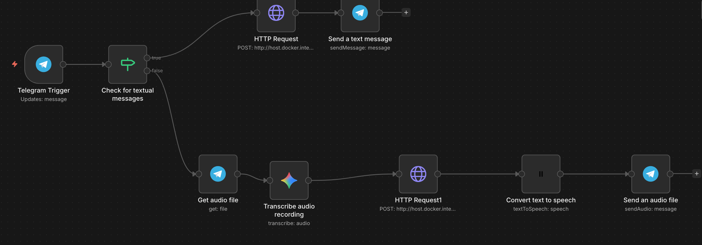

# InsAIdeTrader

InsAIdeTrader is an AI-powered stock market assistant that monitors price movements, sends alerts via Telegram, and lets you manage a simulated portfolio through natural language -- either directly in Telegram or via a REST API that integrates with [n8n](https://n8n.io/) workflows.

## Architecture

```
Telegram ──► n8n (workflow) ──► FastAPI ──► Portfolio Agent ──► Tools ──► SQLite
                                  │
                                  ├─► /portfolio/chat   (natural language)
                                  ├─► /portfolio/buy    (direct REST)
                                  ├─► /portfolio/sell
                                  ├─► /portfolio/deposit
                                  └─► ...

monitor.py ──► Monitor Agent ──► Polygon (market data)
                   │                    │
                   ├─► Researcher Agent (analysis)
                   └─► Telegram notification
```

### Components

| Layer | Location | Description |
|-------|----------|-------------|
| **API** | `insaide-trader/api.py` | FastAPI server exposing portfolio operations over HTTP |
| **Agents** | `insaide-trader/custom_agents/` | Gemini-powered AI agents (Portfolio, Monitor, Researcher) built with the [OpenAI Agents SDK](https://github.com/openai/openai-agents-python) |
| **Tools** | `insaide-trader/tools/` | Market data (Polygon), portfolio management (SQLite), Telegram notifications, stock search |
| **Bots** | `insaide-trader/bots/` | Telegram bot for direct portfolio chat |
| **Infrastructure** | `infrastructure/` | Docker Compose for n8n; ngrok setup for webhook tunneling |

### External Services

| Service | Purpose |
|---------|---------|
| [Google Gemini](https://ai.google.dev/) | Powers all AI agents (`gemini-2.5-flash` for portfolio, `gemini-2.5-pro` for monitoring/research) via the OpenAI-compatible API |
| [Polygon.io](https://polygon.io/) | Stock market data -- EOD prices, market status, ticker search |
| [Telegram Bot API](https://core.telegram.org/bots/api) | User interaction and alert notifications |
| [ElevenLabs](https://elevenlabs.io/) | Text-to-speech audio generation (used in n8n workflows) |
| [n8n](https://n8n.io/) | Workflow automation -- bridges Telegram messages to the API |

### Data Storage

| Database | File | Purpose |
|----------|------|---------|
| Portfolio | `portfolio.db` | Wallet balance, stock holdings, and transaction history |
| Market cache | `accounts.db` | Cached EOD market data from Polygon (avoids repeated API calls) |
| Agent memory | `bot_memory.db` | Multi-turn conversation history per chat session |

## Getting Started

### Prerequisites

- Python 3.12+
- [uv](https://docs.astral.sh/uv/) package manager
- API keys for Gemini, Polygon, and Telegram (see [Environment Variables](#environment-variables))

### Installation

```bash
git clone <repo-url>
cd InsAIdeTrader
cp .env.example .env
# Fill in your API keys in .env

cd insaide-trader
uv sync
```

### Running

**API server** (for n8n or direct HTTP access):

```bash
cd insaide-trader
uv run python api.py
```

Starts on `http://localhost:8000`. Interactive Swagger docs at `http://localhost:8000/docs`.

**Telegram bot** (direct chat, no n8n needed):

```bash
cd insaide-trader
uv run python bots/telegram_bot.py
```

**Market monitor** (checks prices and sends alerts):

```bash
cd insaide-trader
uv run python monitor.py
```

## Environment Variables

Copy `.env.example` to `.env` and fill in your values:

```bash
cp .env.example .env
```

| Variable | Description |
|----------|-------------|
| `GOOGLE_API_KEY` | API key for Google Gemini, used by all AI agents |
| `POLYGON_API_KEY` | API key for [Polygon.io](https://polygon.io/), used to fetch stock market data and search tickers |
| `RUN_EVERY_N_MINUTES` | How often (in minutes) the monitoring agent checks stock prices |
| `RUN_EVEN_WHEN_MARKET_IS_CLOSED` | Set to `True` to run checks even outside market hours |
| `PRICE_CHANGE_THRESHOLD_PERCENT` | Minimum price change percentage to trigger a notification |
| `TELEGRAM_TOKEN` | Bot token from [BotFather](https://t.me/BotFather) for Telegram integration |
| `TELEGRAM_CHAT_ID` | Telegram chat ID where notifications are sent and messages are accepted from |
| `ELEVEN_LABS_API_KEY` | API key for [ElevenLabs](https://elevenlabs.io/), used for text-to-speech in n8n workflows |

## API

The FastAPI server exposes two types of endpoints: a **chat** endpoint that delegates to the Portfolio AI agent, and **direct REST** endpoints for fast, deterministic operations without agent overhead.

### Endpoints

| Method | Path | Description |
|--------|------|-------------|
| `POST` | `/portfolio/chat` | Send a natural-language message to the Portfolio agent |
| `GET` | `/portfolio/balance` | Get current wallet cash balance |
| `POST` | `/portfolio/deposit` | Deposit money into the wallet (`{ "amount": 10000 }`) |
| `GET` | `/portfolio/holdings` | List current stock holdings and wallet balance |
| `POST` | `/portfolio/buy` | Buy shares at market price (`{ "symbol": "AAPL", "shares": 5 }`) |
| `POST` | `/portfolio/sell` | Sell shares at market price (`{ "symbol": "AAPL", "shares": 2 }`) |
| `GET` | `/portfolio/transactions` | View transaction history (optional `?limit=50`) |
| `GET` | `/health` | Health check |

### Chat Endpoint

The `/portfolio/chat` endpoint accepts a JSON body with `message` (required) and an optional `chat_id`:

```json
{ "message": "Buy 10 shares of Apple", "chat_id": 8296901285 }
```

The `chat_id` should be the Telegram chat ID of the user sending the message. This is the key that ties a conversation to a specific Telegram user -- the agent uses it to maintain per-user conversation history (stored in `bot_memory.db`), so each user gets their own session context across messages. When calling from n8n, pass the `chat_id` that Telegram provides in the incoming webhook payload. If omitted, it defaults to the `TELEGRAM_CHAT_ID` from your `.env`.

The agent understands natural language, resolves company names to tickers, checks your wallet balance, and performs the trade -- or explains why it can't.

### Portfolio & Wallet System

All trades use a **wallet-based** system:

1. **Deposit** funds into your wallet first
2. **Buy** stocks -- the cost (shares x current market price) is deducted from the wallet
3. **Sell** stocks -- the proceeds are credited back to the wallet
4. You cannot buy more than your wallet balance allows
5. You cannot sell more shares than you hold
6. All operations are persisted in SQLite and survive restarts

## Agents

### Portfolio Agent

- **Model:** Gemini 2.5 Flash
- **Entry points:** API (`/portfolio/chat`), Telegram bot
- **Capabilities:** Buy/sell stocks, deposit money, check holdings and wallet balance, look up tickers by company name
- **Session memory:** Multi-turn conversation history stored per `chat_id` in `bot_memory.db`

### Monitor Agent

- **Model:** Gemini 2.5 Pro
- **Entry point:** `monitor.py`
- **Capabilities:** Fetches EOD market data from Polygon, identifies stocks that moved beyond the configured threshold, delegates to the Researcher agent for analysis, and sends Telegram notifications with findings
- **Behavior:** Selects the top 5 movers by percentage change and investigates each one

### Researcher Agent

- **Model:** Gemini 2.5 Pro
- **Role:** Sub-agent invoked by the Monitor; researches why a stock moved by searching for recent news, earnings, and catalysts
- **Output:** Company background + specific catalyst or an honest "no catalyst found" assessment

## Infrastructure

See [`infrastructure/README.md`](infrastructure/README.md) for detailed setup instructions.

### n8n

n8n runs in Docker and acts as the workflow layer between Telegram and the API:

```bash
cd infrastructure
docker compose up -d
```

The container uses `host.docker.internal` to reach the FastAPI server running on your machine. In n8n HTTP Request nodes, use:

```
http://host.docker.internal:8000/portfolio/chat
```

### ngrok

[ngrok](https://ngrok.com/) exposes the local n8n instance so Telegram webhooks can reach it. After starting a tunnel (`ngrok http 5678`), update `N8N_HOST` and `WEBHOOK_URL` in `infrastructure/docker-compose.yaml` with your ngrok URL and restart the container.

### n8n Workflow (Voice & Text)

As an alternative to the direct Telegram bot (`telegram_bot.py`), there's an n8n workflow that adds **voice message support**:



**How it works:**

1. **Telegram webhook** receives incoming messages
2. **Route by input type:**
   - **Text message** → call the FastAPI `/portfolio/chat` endpoint → reply with text
   - **Audio message** → transcribe → call `/portfolio/chat` → generate speech with ElevenLabs → reply with audio
3. The core logic always goes through the Python API; n8n just handles the input/output format routing

This gives users the choice of typing or speaking to the portfolio agent, with responses in the same format they used.

**Why n8n?** This project uses n8n as a practical exercise in workflow automation. The same routing logic could be implemented as a dedicated router agent in Python -- n8n simply makes it visual and easy to iterate on without code changes.

## Project Structure

```
InsAIdeTrader/
├── .env.example                          # Template for environment variables
├── README.md
├── infrastructure/
│   ├── README.md
│   └── docker-compose.yaml               # n8n container
└── insaide-trader/
    ├── pyproject.toml                     # Dependencies (managed with uv)
    ├── api.py                             # FastAPI server
    ├── monitor.py                         # Market monitoring entry point
    ├── main.py                            # Development scratch script
    ├── bots/
    │   └── telegram_bot.py                # Telegram bot (direct polling)
    ├── custom_agents/
    │   ├── portfolio.py                   # Portfolio management agent
    │   ├── monitoring.py                  # Market monitoring agent
    │   └── researcher.py                  # Stock research sub-agent
    └── tools/
        ├── market/
        │   ├── database.py                # Market data cache (accounts.db)
        │   ├── market.py                  # Polygon API + price lookups
        │   └── market_server.py           # MCP server for market tools
        ├── portfolio/
        │   ├── database.py                # Portfolio SQLite layer (portfolio.db)
        │   └── portfolio_management.py    # Agent tools for portfolio ops
        ├── notification/
        │   └── telegram_notification.py   # Telegram alert sending
        └── search/
            └── stock_search.py            # Polygon ticker/name search
```
